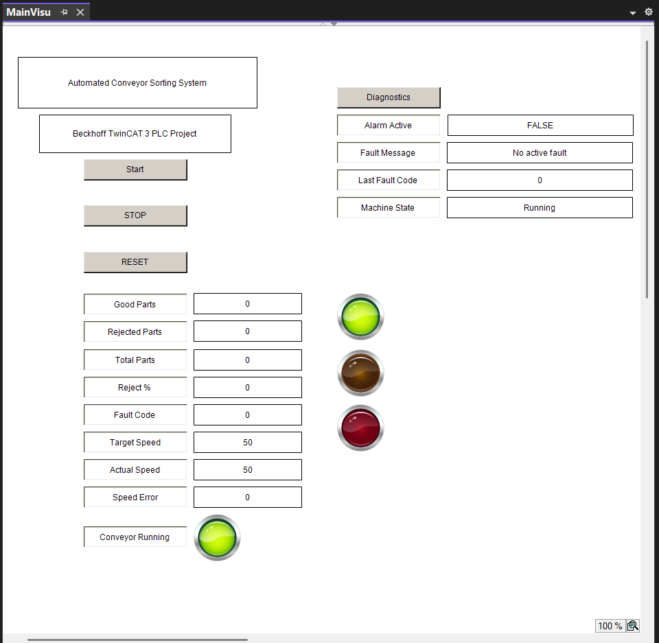
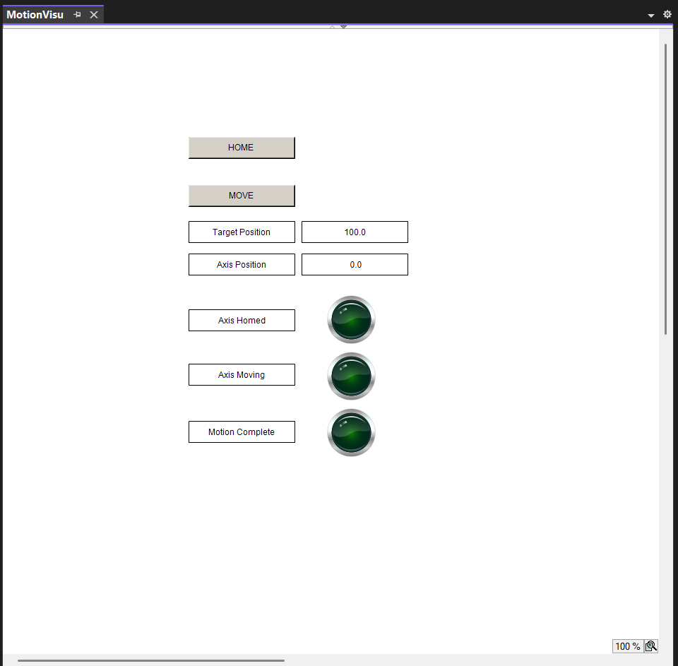
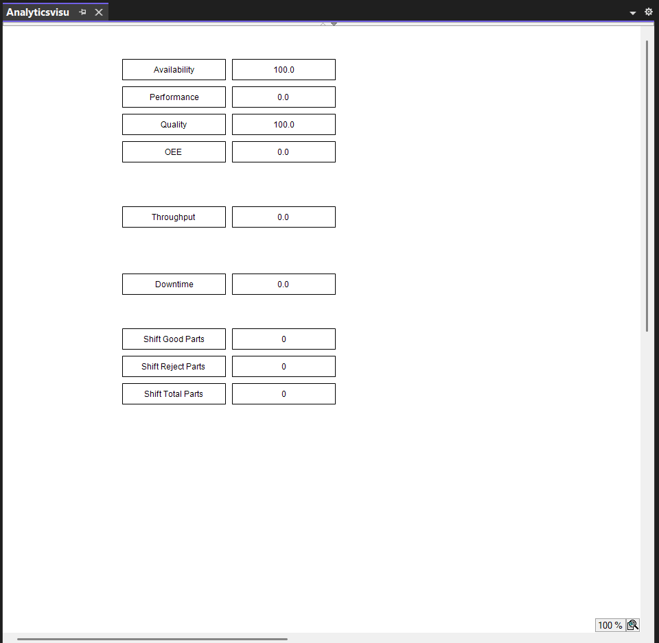
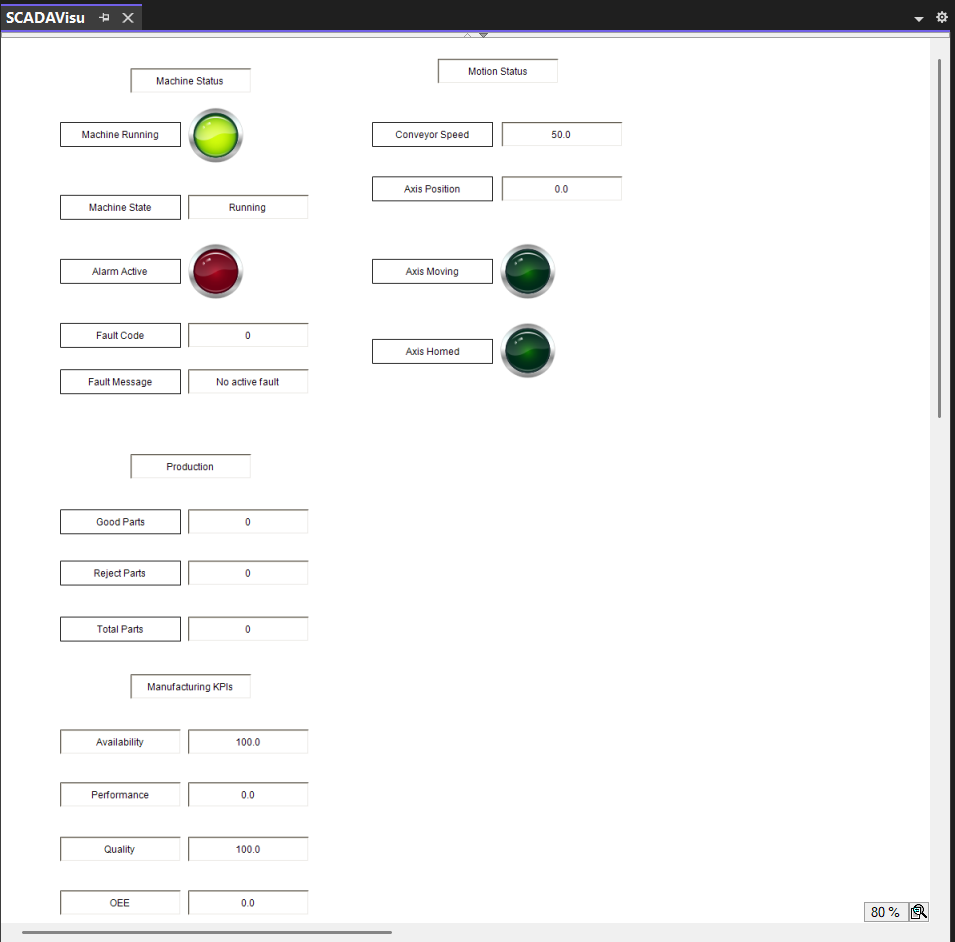

# Beckhoff TwinCAT 3 Automated Conveyor Sorting System

A professional industrial automation portfolio project developed using **Beckhoff TwinCAT 3** and **Structured Text (IEC 61131-3)**.

The project simulates an automated conveyor sorting system with modular PLC architecture, industrial fault handling, motion control simulation, manufacturing analytics, and a SCADA-ready communication layer.

---

# Project Overview

This project demonstrates the design of an industrial conveyor sorting machine similar to those used in automated manufacturing facilities.

The machine is capable of:

- Detecting incoming parts
- Sorting acceptable and rejected parts
- Controlling a reject pusher
- Tracking production statistics
- Monitoring machine faults
- Simulating conveyor speed control
- Simulating servo motion
- Calculating manufacturing KPIs
- Publishing machine data through a SCADA-ready interface

The project was developed as a professional PLC portfolio to demonstrate industrial automation concepts used by manufacturing, controls, and process engineers.

---

## Screenshots

### Main Operator Interface



### Motion Control



### Manufacturing Analytics



### SCADA Dashboard



# Technologies

- Beckhoff TwinCAT 3
- Structured Text (IEC 61131-3)
- PLC Visualization (VISU)
- Modular Function Blocks
- State Machine Architecture
- EtherCAT Architecture Concepts
- SCADA / MES Concepts
- Motion Control Simulation

---

# Features

## Machine Control

- State machine architecture
- Conveyor motor control
- Reject pusher simulation
- Rising edge part detection

---

## Fault Handling

- Jam fault
- Emergency stop fault
- Pusher timeout fault
- Sensor fault
- Alarm management
- Fault diagnostics

---

## Production Tracking

- Good parts
- Reject parts
- Total production
- Reject percentage
- Cycle timing

---

## Motion Control

- Simulated servo axis
- Homing sequence
- Absolute positioning
- Position feedback
- Motion completion status

---

## Manufacturing Analytics

- Overall Equipment Effectiveness (OEE)
- Availability
- Performance
- Quality
- Throughput
- Downtime monitoring
- Shift statistics

---

## SCADA / Industrial Communication

- Published SCADA tag layer
- Read-only supervisory dashboard
- OPC UA architecture concepts
- Beckhoff ADS architecture concepts

---

# Project Structure

```
Automated_Conveyor_Sorting_System

├── PLC
│   └── ConveyorPLC
│       ├── DUTs
│       ├── GVL
│       ├── GVL_IO
│       ├── GVL_SCADA
│       ├── POUs
│       └── VISUs
│
├── SYSTEM
├── MOTION
├── SAFETY
├── VISION
└── ANALYTICS
```
## Software Architecture

The project follows a layered industrial PLC software architecture.

```
Operator
    │
    ▼
MainVisu / MotionVisu / AnalyticsVisu / SCADAVisu
    │
    ▼
GVL / GVL_IO / GVL_SCADA
    │
    ▼
MAIN Program
    │
    ▼
Function Blocks
    │
    ▼
Simulated Machine
```

See `docs/System_Architecture.md` for the complete architecture documentation.

---

# Function Blocks

The project uses a modular PLC architecture.

- FB_Conveyor
- FB_Pusher
- FB_ProductionTracker
- FB_SpeedControl
- FB_AlarmManager
- FB_StateMachine
- FB_Axis

---

# Visualization Screens

### MainVisu

Primary machine operation interface.

- Start
- Stop
- Reset
- Production counters
- Alarm indicators
- Conveyor status

---

### MotionVisu

Motion control interface.

- Home axis
- Move axis
- Position display
- Motion status

---

### AnalyticsVisu

Manufacturing dashboard.

- OEE
- Availability
- Performance
- Quality
- Throughput
- Downtime

---

### SCADAVisu

Supervisory monitoring dashboard.

- Machine status
- Alarm information
- Production statistics
- Manufacturing KPIs
- Motion status

---

# Software Architecture

```
Operator
        │
        ▼

MainVisu
MotionVisu
AnalyticsVisu
SCADAVisu

        │
        ▼

MAIN

        │

──────────────────────────────────────

FB_Conveyor
FB_Pusher
FB_ProductionTracker
FB_SpeedControl
FB_AlarmManager
FB_StateMachine
FB_Axis

──────────────────────────────────────

GVL_SCADA

        │

ADS / OPC UA (Concept)

        │

SCADA / MES / Historian
```

---

# Engineering Concepts Demonstrated

- PLC Programming
- Structured Text
- State Machine Design
- Modular Software Architecture
- Industrial Diagnostics
- Motion Control Concepts
- EtherCAT Concepts
- SCADA Architecture
- Manufacturing Analytics
- Production Monitoring
- Human-Machine Interface Design

---

# Project Status

| Phase | Status |
|--------|--------|
| PLC Architecture | Complete |
| State Machine | Complete |
| Fault Handling | Complete |
| Production Tracking | Complete |
| Function Blocks | Complete |
| Visualization | Complete |
| Speed Control | Complete |
| EtherCAT Architecture | Complete |
| Motion Control | Complete |
| Manufacturing Analytics | Complete |
| SCADA Architecture | Complete |

---

## Documentation

- [Functional Specification](docs/Functional_Specification.md)
- [Software Architecture](docs/System_Architecture.md)
- [State Machine Documentation](docs/State_Machine.md)
- [Function Block Documentation](docs/Function_Blocks.md)
- [I/O List](docs/IO_List.md)
- [EtherCAT Architecture](docs/EtherCAT_Architecture.md)
- [Original Test Plan](docs/Test_Plan.md)
- [Commissioning and Validation Test Report](docs/Commissioning_Test_Report.md)
---

### State Machine Documentation

The complete machine sequence and state transition documentation is available in:

- `docs/State_Machine.md`

# Learning Outcomes

This project demonstrates how industrial PLC software can be structured using modular function blocks, reusable software architecture, manufacturing analytics, and supervisory communication concepts.

The implementation follows engineering practices commonly used in industrial automation systems while remaining fully executable within the TwinCAT simulation environment.

---

# Future Improvements

Potential future enhancements include:

- Physical Beckhoff EtherCAT hardware
- Real servo drives
- OPC UA client integration
- SQL database logging
- Factory I/O integration
- User authentication
- Recipe management
- Maintenance scheduling
